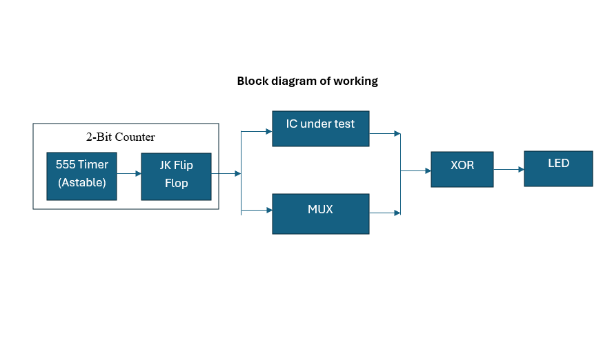

# Digital IC Tester for Logic Gates

A pure hardware-based digital logic IC tester built as part of the Analog and Digital Circuits Lab (4th Semester, EEE — NIT Goa).

Tests the functional correctness of logic gate ICs by automatically cycling through all input combinations and comparing the output against a manually set reference logic.

## System Architecture

---

## Supported Gates

| Gate | IC Number |
|------|-----------|
| AND  | 7408      |
| OR   | 7432      |
| NAND | 7400      |
| XOR  | 7486      |
| XNOR | 74266     |

> NOT and NOR gates require a small wiring modification — see [docs/modifications.md](docs/modifications.md)

---
## How It Works

### 1. 555 Timer — Clock Generation
Configured in astable mode to generate a continuous square wave clock signal.
Frequency: `f = 1.44 / ((R1 + 2*R2) * C)`

### 2. JK Flip-Flop — Binary Counter
Operated in toggle mode (J=K=1). Two flip-flops create a 2-bit counter that cycles through all input combinations: `00 → 01 → 10 → 11`

### 3. Counter Output — Dual Path
The 2-bit counter output is fed simultaneously to:
- The **IC under test** — as the actual input combinations
- The **4:1 MUX** — as select lines to pick the corresponding expected output

### 4. XOR Comparator — Fault Detection
Compares actual IC output against MUX reference output:
- XOR output = 0 → outputs match → IC is working
- XOR output = 1 → outputs differ → IC is faulty

**LED indication:** OFF = pass, ON = fault

## Contributors
This project was developed collaboratively by:

- Aayush Singh
- Abdullah P P
- Abhishek Rathor
- Ansh Yadav

All team members participated in the design, development, testing, and documentation of the project.

## Institution
NIT Goa — EEE Department, 4th Semester Analog and Digital Circuits Lab
